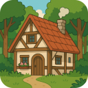

# かれは開発室 - Kareha Hub

私は科学と哲学そしてファンタジーが大好きです！  
I love Science, Philosophy and Fantasy!

ここでは私が作っているソフトウェアや、想いを綴った文章を紹介します。  
On this site, I introduce the software I develop and the ideas I’ve expressed in writing.

## 作ってるものたち - My Projects

* [私が作ったmicroのプラグインたち](https://github.com/akikareha/micro-unofficial-plugin-channel/)  
  micro Plugins I developed
* [microのスクリーンショットたち](https://akikareha.github.io/micro-screenshots/)  
  micro Screenshots
* [世間のmicroのプラグインのリスト](https://akikareha.github.io/micro-plugin-list/)  
  Public micro Plugin List
* [GNU Typistのレッスンたち](https://github.com/akikareha/gtypist-programming-lessons/)  
  GNU Typist Lessons
* [タイピング練習器typtut](https://github.com/akikareha/typtut/) [[デモ](https://akikareha.github.io/typtut/)]  
  Typing Tutor typtut

## 思うことたち - My Thoughts

* [鬱の底から這い上がりたい](depression.html)  
  I Want to Climb Out of the Depths of Depression
* [キーボードはデジタイザ](keyboard.html)  
  The Keyboard Is a Digitizer
* [microは21世紀の優しいテキストエディタ](micro.html)  
  Micro: A Gentle Text Editor for the 21st Century
* [お気に入りのフォーマッタたち](formatters.html)  
  My Favorite Formatters
* [私のGitHubページの作り方](github-pages.html)  
  How I Made My GitHub Page
* [microのプラグインを作ってる人を探してみる](find-micro-plugin-developers.html)  
  Trying to Find micro Plugin Developers

## 舞台裏 - Backstage

* [下書きたち](drafts.html) - Drafts
* [雑記](note.html) - Note

## 姉妹サイトたち - Sister Sites

かれは開発室は、[かれは研究室](https://kareha.org/)の別室です。  
Kareha Hub is an annex to [Kareha Lab](https://kareha.org/).
